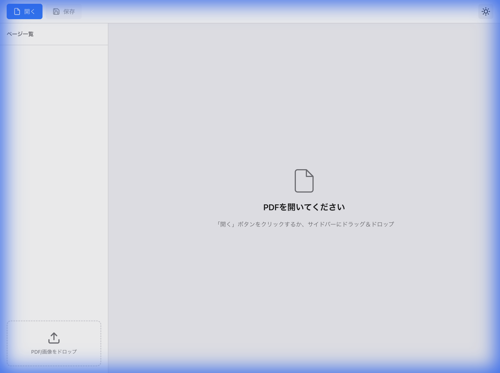

# PDF Editor

クロスプラットフォーム対応のWebベースPDF編集ツール



## 機能

- 📄 **PDF読み込み**: 既存PDFを読み込み、サムネイルプレビューを表示
- 🖼️ **画像挿入**: PNG/JPEGをドラッグ＆ドロップでPDFページとして挿入
- 🔀 **ページ並べ替え**: サムネイルをドラッグして順序を変更
- ❌ **ページ削除**: ショートカットキーで選択ページを削除
- 💾 **PDF出力**: 編集後のPDFをダウンロード
- 🌙 **ダークモード**: システム設定に合わせたテーマ切り替え

## 技術スタック

- **言語**: TypeScript
- **ビルドツール**: Vite
- **PDFライブラリ**: 
  - [pdf-lib](https://pdf-lib.js.org/) - PDF編集
  - [pdf.js](https://mozilla.github.io/pdf.js/) - PDFレンダリング

## クイックスタート

```bash
# 依存関係インストール
npm install

# 開発サーバー起動
npm run dev

# ビルド
npm run build
```

開発サーバー起動後、http://localhost:5173/ にアクセスしてください。

## キーボードショートカット

| ショートカット | 動作 | プラットフォーム |
|----------------|------|------------------|
| `Ctrl + O` / `Cmd + O` | PDFを開く | Windows / Mac |
| `Ctrl + S` / `Cmd + S` | PDFを保存 | Windows / Mac |
| `Ctrl + D` / `Cmd + D` | ページ削除 | Windows / Mac |
| `↑` / `↓` | ページ選択 | 共通 |

## 使い方

1. **PDF読み込み**: 「開く」ボタンをクリック、またはサイドバーにドラッグ＆ドロップ
2. **画像追加**: PNG/JPEGファイルをサイドバーにドラッグ＆ドロップ
3. **並べ替え**: サムネイルをドラッグして移動
4. **削除**: ページを選択して `Ctrl/Cmd + D`
5. **保存**: 「保存」ボタンをクリックしてPDFをダウンロード

## 対応ブラウザ

- Chrome (Windows/Mac)
- Firefox (Windows/Mac)
- Safari (Mac)
- Edge (Windows)

## ライセンス

MIT License
