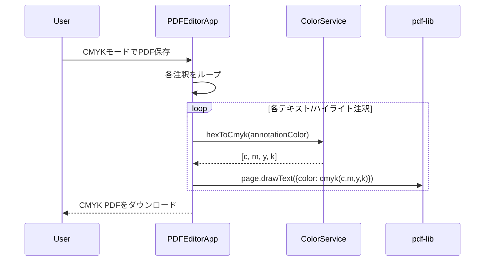
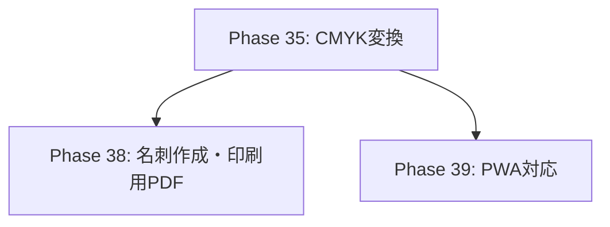

# Phase 35: CMYK変換・印刷用出力 - 実装計画

> **作成日**: 2026-01-14  
> **Phase**: 35  
> **目的**: RGB PDFをCMYKに変換し、印刷用途に適したPDF出力を実現する

---

## 1. 概要

### 1.1 背景

現在のPDFエディタはRGBカラースペースで動作しているが、商業印刷ではCMYKカラースペースが必須となる。
本Phaseでは、クライアントサイドでのRGB→CMYK変換機能を実装し、印刷用PDFを出力可能にする。

### 1.2 ゴール

- ✅ RGB画像・テキスト注釈をCMYKカラースペースに変換
- ✅ CMYKプレビュー機能（印刷イメージの確認）
- ✅ CMYK PDF出力機能
- ✅ ICCプロファイル対応（オプション）

---

## 2. 技術調査結果

### 2.1 ライブラリ選定

| ライブラリ | 用途 | 採用 |
|-----------|------|------|
| **color-convert** | RGB ↔ CMYK 変換 | ✅ 採用 |
| **pdf-lib** | CMYK色でのPDF描画 | ✅ 採用（既存） |
| @imgly/plugin-print-ready-pdfs-web | 商用プラグイン | ❌ 有料のため不採用 |

### 2.2 技術的制約

1. **ブラウザCanvas**: RGB(A)のみ対応。CMYKレンダリングは不可。
2. **CMYKプレビュー**: RGB→CMYK→RGB逆変換で「シミュレート」表示。
3. **pdf-lib**: `cmyk(c, m, y, k)` メソッドでCMYK色を直接指定可能。

### 2.3 pdf-lib CMYK サポート

```typescript
import { PDFDocument, cmyk } from 'pdf-lib';

// CMYK色の指定（0〜1の範囲）
const cmykBlack = cmyk(0, 0, 0, 1);
const cmykRed = cmyk(0, 1, 1, 0);

page.drawText('印刷用テキスト', {
    x: 50,
    y: 500,
    color: cmykBlack,
});
```

---

## 3. 実装計画

### 3.1 新規ファイル

#### [NEW] `src/services/ColorService.ts`

RGB↔CMYK変換を担当するサービスクラス。

```typescript
import convert from 'color-convert';

export class ColorService {
    /**
     * RGB (0-255) → CMYK (0-1)
     */
    static rgbToCmyk(r: number, g: number, b: number): [number, number, number, number] {
        const [c, m, y, k] = convert.rgb.cmyk(r, g, b);
        // color-convert は 0-100 で返すので 0-1 に正規化
        return [c / 100, m / 100, y / 100, k / 100];
    }

    /**
     * CMYK (0-1) → RGB (0-255)
     * プレビュー用の逆変換
     */
    static cmykToRgb(c: number, m: number, y: number, k: number): [number, number, number] {
        const [r, g, b] = convert.cmyk.rgb(c * 100, m * 100, y * 100, k * 100);
        return [r, g, b];
    }

    /**
     * HEX文字列 → CMYK (0-1)
     */
    static hexToCmyk(hex: string): [number, number, number, number] {
        const rgb = convert.hex.rgb(hex.replace('#', ''));
        return this.rgbToCmyk(rgb[0], rgb[1], rgb[2]);
    }

    /**
     * CMYK色域警告（Gamut Warning）
     * RGBで表現可能な色域を超えていないかチェック
     */
    static isOutOfGamut(r: number, g: number, b: number): boolean {
        const cmyk = this.rgbToCmyk(r, g, b);
        const [r2, g2, b2] = this.cmykToRgb(...cmyk);
        const deltaE = Math.sqrt(
            Math.pow(r - r2, 2) + Math.pow(g - g2, 2) + Math.pow(b - b2, 2)
        );
        return deltaE > 10; // 閾値（調整可能）
    }
}
```

---

### 3.2 既存ファイルの修正

#### [MODIFY] `src/types/index.ts`

```typescript
// 追加する型定義
export interface ExportOptions {
    colorSpace: 'rgb' | 'cmyk';
    includeTrimMarks?: boolean;  // トンボ（将来のPhase 38用）
    bleed?: number;              // 塗り足し（mm）
}

export interface AppState {
    // 既存フィールド...
    exportOptions: ExportOptions;  // ← 追加
}
```

---

#### [MODIFY] `src/main.ts` - PDFEditorApp

**変更箇所1**: `state` の初期化に `exportOptions` 追加

```typescript
public state: AppState = {
    pages: [],
    selectedPageIndex: -1,
    selectedPageIndices: [],
    isLoading: false,
    isDarkMode: false,
    originalPdfBytes: null,
    exportOptions: {
        colorSpace: 'rgb',  // デフォルトはRGB
    },
};
```

**変更箇所2**: `savePDF()` メソッドの拡張

```typescript
async savePDF(): Promise<void> {
    if (this.state.pages.length === 0) return;
    
    const isCmyk = this.state.exportOptions.colorSpace === 'cmyk';
    
    // ... 既存のPDF生成ロジック ...
    
    // CMYK出力時はColorServiceを使用
    if (isCmyk) {
        // テキスト注釈の色をCMYKに変換
        for (const page of this.state.pages) {
            if (page.textAnnotations) {
                for (const annotation of page.textAnnotations) {
                    const cmykColor = ColorService.hexToCmyk(annotation.color);
                    // pdf-lib の cmyk() 関数で色を指定
                }
            }
        }
    }
}
```

---

#### [MODIFY] `src/managers/ToolbarManager.ts`

CMYK切り替えUIの追加。

```typescript
// 新しいUI要素
public setupCmykToggle(): void {
    const cmykToggle = this.elements.cmykModeToggle;
    if (cmykToggle) {
        cmykToggle.addEventListener('change', (e) => {
            const isChecked = (e.target as HTMLInputElement).checked;
            // AppAction経由で設定を更新
        });
    }
}
```

---

#### [MODIFY] `index.html`

ツールバーにCMYKトグルを追加。

```html
<!-- エクスポートオプションセクション（ファイルメニュー or 独立UI） -->
<div class="export-options">
    <label class="cmyk-toggle">
        <input type="checkbox" id="cmyk-mode-toggle">
        <span class="toggle-label">CMYKモード</span>
        <span class="toggle-hint">(印刷用)</span>
    </label>
</div>
```

---

### 3.3 タスク詳細

#### 35.1 CMYK変換ライブラリの導入

- [ ] `color-convert` パッケージのインストール
- [ ] `src/services/ColorService.ts` の作成
- [ ] 単体変換テストの実施

```bash
npm install color-convert
npm install -D @types/color-convert
```

#### 35.2 RGB→CMYK変換処理の実装

- [ ] `ColorService.rgbToCmyk()` 実装
- [ ] `ColorService.hexToCmyk()` 実装
- [ ] テキスト注釈の色変換対応
- [ ] ハイライト注釈の色変換対応

#### 35.3 CMYKプレビュー機能

- [ ] プレビュー用の色シミュレーション実装（RGB→CMYK→RGB）
- [ ] ガマット警告表示（色域外の色をハイライト）
- [ ] CMYKモード時のCanvas描画調整

#### 35.4 CMYK PDF出力機能

- [ ] `savePDF()` のCMYK対応拡張
- [ ] pdf-lib の `cmyk()` 関数を使った色指定
- [ ] 画像のCMYK変換（ラスタライズ必要）
- [ ] 出力設定UI（CMYKモードトグル）

---

## 4. requirements.md 更新内容

以下の内容を `requirements.md` に追記する。

```markdown
### 2.16 CMYK変換・印刷用出力

| ID | 要件 | 優先度 |
|----|------|--------|
| F-058 | RGB → CMYK 変換機能を提供する | 必須 |
| F-059 | CMYKモードでのPDF保存ができる | 必須 |
| F-060 | CMYKプレビュー（印刷イメージ確認）ができる | 必須 |
| F-061 | ガマット警告（色域外の色を視覚的に警告）が表示される | 任意 |
| F-062 | ICCプロファイルを指定してCMYK変換ができる | 任意（将来対応） |
```

---

## 5. design.md 更新内容

以下の内容を `design.md` に追記する。

```markdown
## 13. CMYK変換機能

### 13.1 アーキテクチャ

```mermaid
graph LR
    A[RGB画像/注釈] --> B[ColorService]
    B --> C[CMYK値]
    C --> D[pdf-lib cmyk()]
    D --> E[CMYK PDF出力]
    
    B --> F[CMYK→RGBシミュレート]
    F --> G[Canvas描画プレビュー]
```

### 13.2 ColorService

```typescript
class ColorService {
    // RGB (0-255) → CMYK (0-1)
    static rgbToCmyk(r: number, g: number, b: number): [number, number, number, number];

    // CMYK (0-1) → RGB (0-255) - プレビュー用
    static cmykToRgb(c: number, m: number, y: number, k: number): [number, number, number];

    // HEX文字列 → CMYK
    static hexToCmyk(hex: string): [number, number, number, number];

    // ガマット警告判定
    static isOutOfGamut(r: number, g: number, b: number): boolean;
}
```

### 13.3 CMYK変換のフロー



### 13.4 制約事項

| 項目 | 制約 |
|------|------|
| 画像のCMYK変換 | Canvas経由でラスタライズが必要（品質低下の可能性） |
| ブラウザプレビュー | RGBシミュレートのみ（真のCMYKプレビューは不可） |
| ICCプロファイル | 将来対応（現時点では固定変換式） |
```

---

## 6. 検証計画

### 6.1 自動テスト

現在、本プロジェクトにはユニットテストフレームワークが導入されていないため、手動検証を中心とする。

### 6.2 手動検証手順

#### 検証1: ColorService の変換精度

1. 開発サーバーを起動: `npm run dev`
2. ブラウザのDevToolsコンソールを開く
3. 以下のコードを実行して変換結果を確認:

```javascript
// ColorService のインポート後
const [c, m, y, k] = ColorService.rgbToCmyk(255, 0, 0); // 赤
console.log('Red CMYK:', c, m, y, k); // 期待値: 0, 1, 1, 0 付近

const [c2, m2, y2, k2] = ColorService.hexToCmyk('#00FF00'); // 緑
console.log('Green CMYK:', c2, m2, y2, k2); // 期待値: 1, 0, 1, 0 付近
```

#### 検証2: CMYK PDF出力

1. PDFを読み込む
2. テキスト注釈を追加（赤色）
3. CMYKモードを有効にする
4. PDFを保存
5. 保存されたPDFをAdobe Acrobat等で開き、「出力プレビュー」でCMYKカラースペースを確認

#### 検証3: CMYKプレビュー

1. CMYKモードを有効にする
2. プレビュー画面の色味が若干変化することを確認
3. ガマット警告が必要な色（蛍光色など）が警告表示されることを確認

---

## 7. リスクと対策

| リスク | 影響 | 対策 |
|--------|------|------|
| 画像のCMYK変換品質 | 高 | ラスタライズ時の解像度を高く設定（300dpi以上） |
| ブラウザ依存の色再現 | 中 | シミュレート表示である旨をUIで明記 |
| 変換精度の限界 | 中 | ICCプロファイル対応を将来Phase（36以降）で検討 |

---

## 8. 依存関係



Phase 38（トンボ・塗り足し）はPhase 35のCMYK機能に依存するため、順番に実装する。

---

## 9. 工数見積もり

| タスク | 見積もり |
|--------|----------|
| 35.1 ライブラリ導入 | 0.5時間 |
| 35.2 変換処理実装 | 2時間 |
| 35.3 プレビュー機能 | 3時間 |
| 35.4 PDF出力機能 | 3時間 |
| 検証・調整 | 2時間 |
| **合計** | **10.5時間** |

---

## 10. チェックリスト

- [ ] `color-convert` インストール完了
- [ ] `ColorService.ts` 作成完了
- [ ] `types/index.ts` に `ExportOptions` 追加
- [ ] `main.ts` の `savePDF()` CMYK対応
- [ ] CMYKトグルUI実装
- [ ] CMYKプレビュー実装
- [ ] ガマット警告実装
- [ ] 手動検証完了
- [ ] `requirements.md` 更新
- [ ] `design.md` 更新
