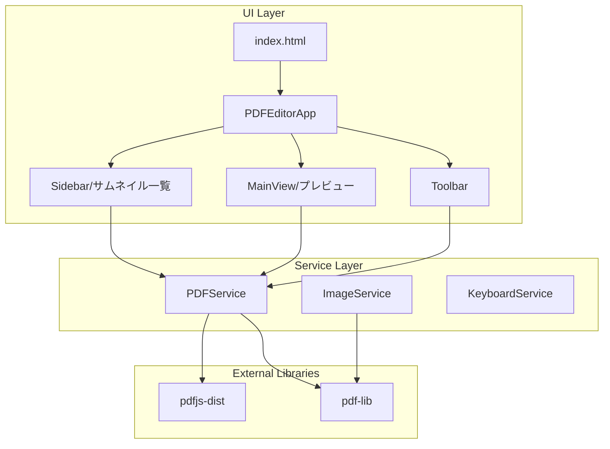
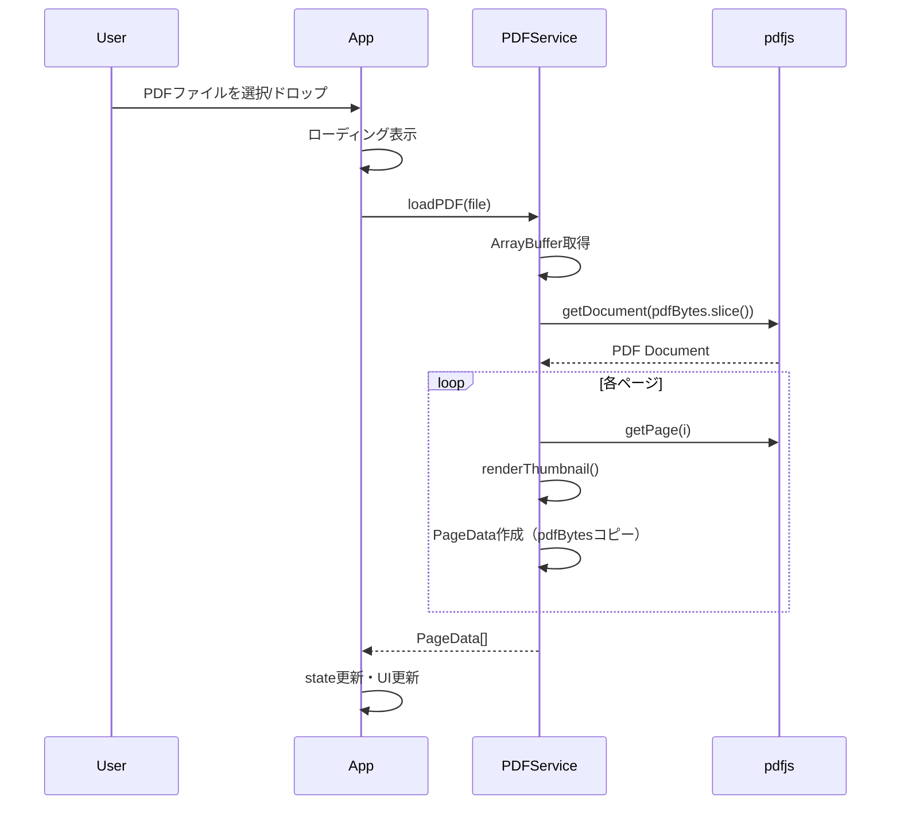
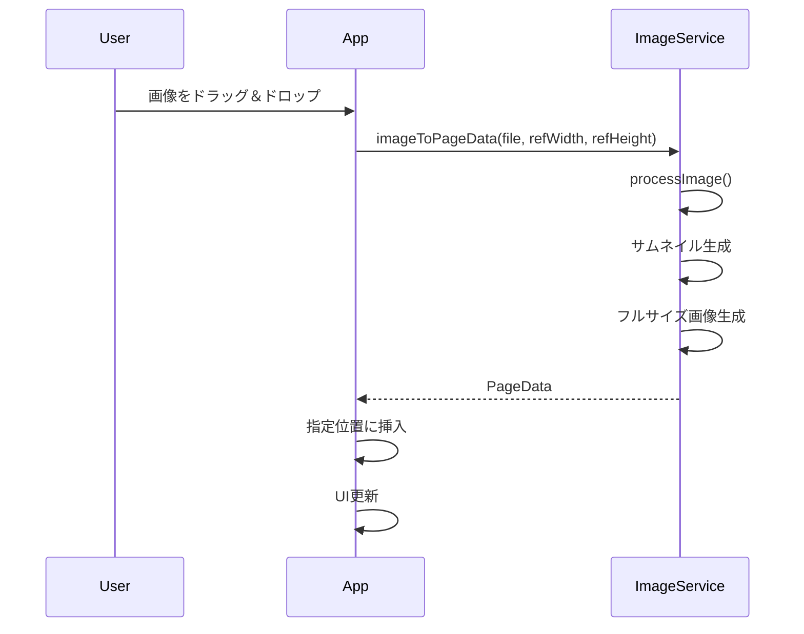
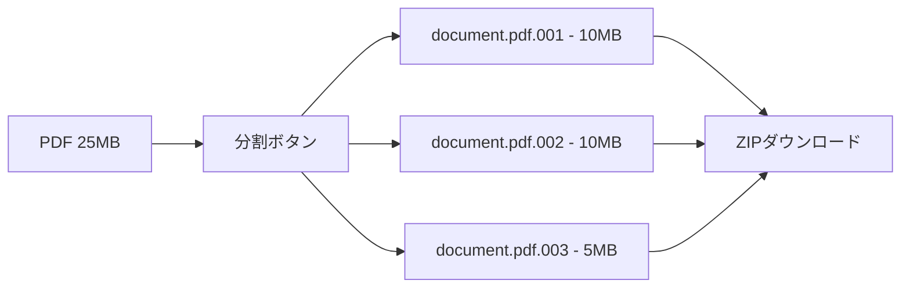

# PDF Editor - 設計書

## 1. アーキテクチャ概要



---

## 2. ディレクトリ構成

```
pdfeditor/
├── docs/
│   ├── requirements.md      # 要件定義書
│   ├── design.md            # 設計書（本ファイル）
│   └── tasks.md             # タスク一覧
├── src/
│   ├── main.ts              # アプリケーションエントリー・メインロジック
│   ├── styles/
│   │   └── index.css        # 全スタイル統合
│   ├── services/
│   │   ├── PDFService.ts    # PDF操作サービス
│   │   ├── ImageService.ts  # 画像処理サービス
│   │   └── KeyboardService.ts # キーボードショートカット
│   ├── types/
│   │   └── index.ts         # 型定義
│   └── utils/
│       └── uuid.ts          # UUID生成
├── index.html               # エントリーポイントHTML
├── package.json
├── tsconfig.json
├── vite.config.ts
└── README.md
```

---

## 3. 状態管理

### 3.1 アプリケーション状態

```typescript
interface AppState {
    pages: PageData[];           // ページ情報一覧
    selectedPageIndex: number;   // 選択中のページインデックス
    isLoading: boolean;          // ローディング状態
    isDarkMode: boolean;         // ダークモード状態
    originalPdfBytes: Uint8Array | null;  // 元PDFのバイトデータ
}
```

### 3.2 ページデータ

```typescript
interface PageData {
    id: string;                  // 一意のID
    type: 'pdf' | 'image';       // ページタイプ
    pdfBytes?: Uint8Array;       // PDF元データ
    imageBytes?: Uint8Array;     // 画像元データ
    thumbnail: string;           // サムネイル画像 (data URL)
    fullImage?: string;          // フルサイズ画像 (data URL, 画像ページ用)
    width: number;               // ページ幅 (pt)
    height: number;              // ページ高さ (pt)
    rotation?: number;           // 回転角度 (0, 90, 180, 270)
    textAnnotations?: TextAnnotation[];        // テキスト注釈
    highlightAnnotations?: HighlightAnnotation[]; // ハイライト注釈
    originalWidth?: number;      // 元画像幅 (px)
    originalHeight?: number;     // 元画像高さ (px)
    originalPageIndex?: number;  // PDF由来のページインデックス
}
```

### 3.3 注釈・操作ログ

```typescript
interface TextAnnotation {
    id: string;
    text: string;
    x: number;
    y: number;
    fontSize: number;
    color: string;
}

interface HighlightAnnotation {
    id: string;
    x: number;
    y: number;
    width: number;
    height: number;
    color: string;
}

// Undo操作の型定義
type UndoAction =
    | { type: 'deletePage'; page: PageData; index: number }
    | { type: 'movePage'; fromIndex: number; toIndex: number }
    | { type: 'rotatePage'; pageId: string; previousRotation: number }
    | { type: 'clear'; pages: PageData[]; selectedIndex: number }
    | { type: 'addText'; pageId: string; annotationId: string }
    | { type: 'addHighlight'; pageId: string; annotationId: string }
    | { type: 'addImage'; pageId: string; index: number };

```

---

## 4. サービス設計

### 4.1 PDFService

```typescript
class PDFService {
    // PDF読み込み
    async loadPDF(file: File): Promise<LoadResult>;
    
    // PDFからページ抽出（ArrayBufferコピー対策済み）
    async extractPages(pdfBytes: Uint8Array): Promise<PageData[]>;
    
    // サムネイル生成
    async renderThumbnail(page: PDFPageProxy, scale: number): Promise<string>;
    
    // ページをCanvasにレンダリング
    async renderToCanvas(canvas: HTMLCanvasElement, pageData: PageData): Promise<void>;
    
    // ページ削除
    removePageAt(pages: PageData[], index: number): PageData[];
    
    // ページ挿入
    insertPageAt(pages: PageData[], page: PageData, index: number): PageData[];
    
    // ページ並べ替え
    reorderPages(pages: PageData[], fromIndex: number, toIndex: number): PageData[];

    // 画像エクスポート（単一ページ）
    async exportPageAsImage(page: PageData): Promise<Blob>;

    // 一括エクスポート（ZIP）
    async exportAllPagesAsZip(pages: PageData[]): Promise<Blob>;

    // バイナリ分割
    splitBinary(data: Uint8Array, maxSize?: number): Uint8Array[];

    // バイナリ分割してZIPでダウンロード（catコマンドで結合可能）
    async splitBinaryAsZip(pdfBytes: Uint8Array, baseName: string, maxSize?: number): Promise<Blob>;
}
```

### 4.2 ImageService

```typescript
class ImageService {
    // 画像をPageDataに変換（ページサイズにフィット）
    async imageToPageData(
        file: File,
        referenceWidth: number,
        referenceHeight: number
    ): Promise<PageData>;
    
    // 画像をPDFページとして埋め込む
    async embedImageToPdf(pdfDoc: PDFDocument, pageData: PageData): Promise<void>;
}
```

### 4.3 KeyboardService

```typescript
class KeyboardService {
    // キーボードイベントリスナー登録
    init(): void;
    
    // ショートカット追加
    addShortcut(key: string, modifiers: string[], callback: () => void): void;
    
    // クリーンアップ
    destroy(): void;
}
```

---

## 5. UI設計

### 5.1 レイアウト

```
+------------------------------------------------------------------+
|  [開く] [保存] [分割] [画像] [上へ] [下へ] [画像] [全保存]  [🌙 Theme]  |  ← Toolbar
+------------------+-----------------------------------------------+
|                  |                                               |
|  +-----------+   |   [ファイルを開く]                            |
|  | Page 1    |   |                                               |
|  +-----------+   |   またはファイルをドロップ                      |
|  | Page 2    |   |                                               |
|  +-----------+   |             (Empty State)                     |
|     (選択中)      |                                               |
|  +-----------+   |                                               |
|  | Page 3    |   |                                               |
|  +-----------+   |                                               |
|                  |                                               |
|  [ドロップゾーン]  |                                               |
|                  |                                               |
+------------------+-----------------------------------------------+
      Sidebar (180px)                    MainView (flex: 1)
```

### 5.2 カラースキーム

```css
/* ライトモード */
:root {
    --bg-primary: #ffffff;
    --bg-secondary: #f5f5f7;
    --bg-tertiary: #e8e8ed;
    --text-primary: #1d1d1f;
    --text-secondary: #6e6e73;
    --accent: #007aff;
    --border: #d2d2d7;
}

/* ダークモード */
:root.dark {
    --bg-primary: #1c1c1e;
    --bg-secondary: #2c2c2e;
    --bg-tertiary: #3a3a3c;
    --text-primary: #f5f5f7;
    --text-secondary: #98989d;
    --accent: #0a84ff;
    --border: #38383a;
}
```

---

## 6. キーボードショートカット

| ショートカット | 動作 | プラットフォーム |
|----------------|------|------------------|
| `Ctrl + O` | PDFを開く | Windows |
| `Cmd + O` | PDFを開く | Mac |
| `Ctrl + S` | PDFを保存 | Windows |
| `Cmd + S` | PDFを保存 | Mac |
| `Ctrl + D` | 選択ページ削除 | Windows |
| `Cmd + D` | 選択ページ削除 | Mac |
| `↑` | 前のページを選択 | 共通 |
| `↓` | 次のページを選択 | 共通 |

---

## 7. 処理フロー

### 7.1 PDF読み込みフロー



### 7.2 画像挿入フロー



---

## 8. エラーハンドリング

| エラー種別 | 対応 |
|------------|------|
| 非対応ファイル形式 | トースト通知で警告表示 |
| PDF読み込み失敗 | エラーメッセージ表示 |
| 画像処理失敗 | エラーメッセージ表示 |
| ArrayBuffer detachment | 事前にslice()でコピー |

---

## 9. 外部依存関係

```json
{
    "dependencies": {
        "pdf-lib": "^1.17.1",
        "pdfjs-dist": "^4.10.38"
    },
    "devDependencies": {
        "typescript": "~5.6.2",
        "vite": "^6.0.5"
    }
}
```

---

## 10. 既知の制約・注意点

- **ArrayBuffer detachment**: pdfjs-distはWorkerにArrayBufferを転送するとdetachされるため、事前にslice()でコピーが必要
- **暗号化PDF**: 非対応
- **大容量ファイル**: 100MB以上のPDFはパフォーマンス保証外

---

## 11. バイナリ分割機能

メール添付の容量制限（10MB）に対応するための機能。

### 11.1 処理フロー



### 11.2 受信側での結合方法

**Linux/Mac:**
```bash
cat document.pdf.* > document.pdf
```

**Windows (コマンドプロンプト):**
```cmd
copy /b document.pdf.001+document.pdf.002+document.pdf.003 document.pdf
```

**Windows (PowerShell):**
```powershell
Get-Content document.pdf.* -Encoding Byte -ReadCount 0 | Set-Content document.pdf -Encoding Byte
```
