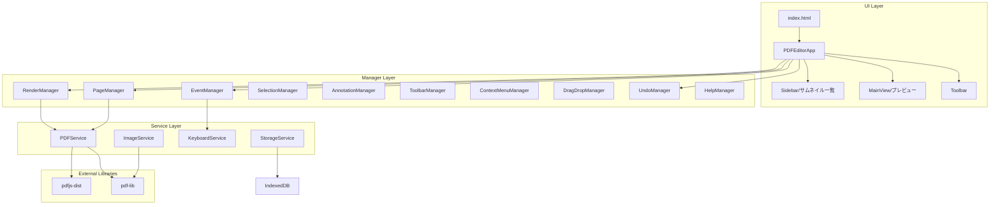
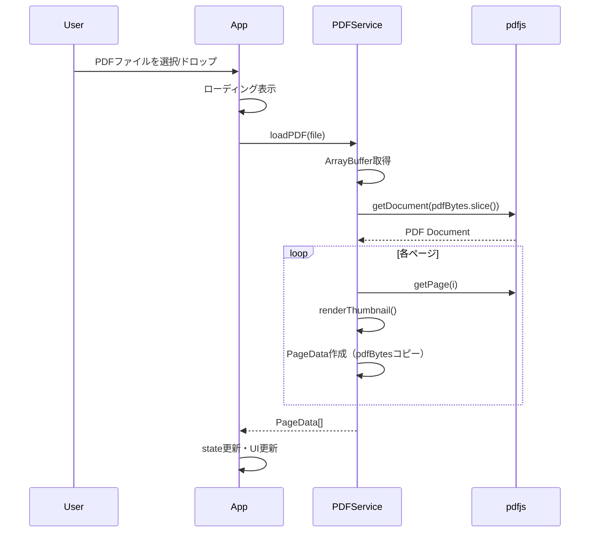
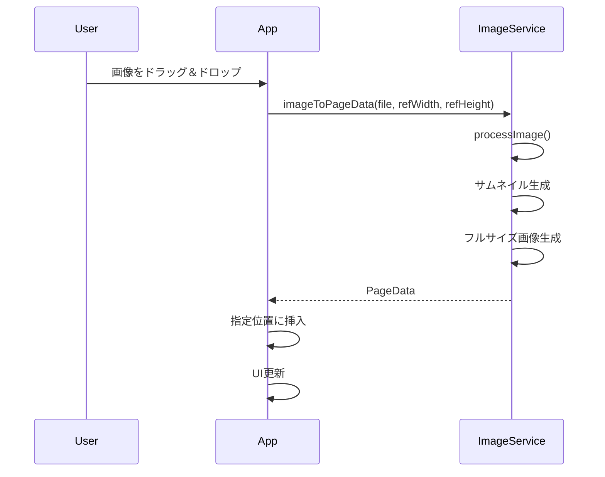
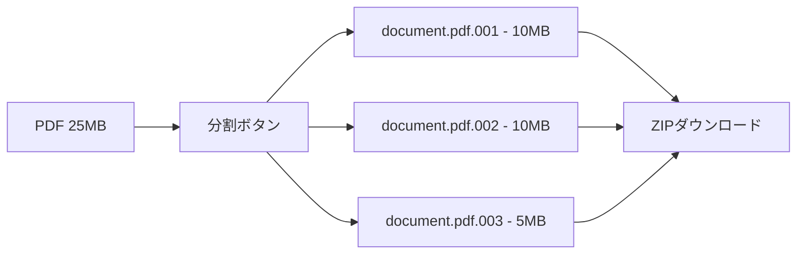
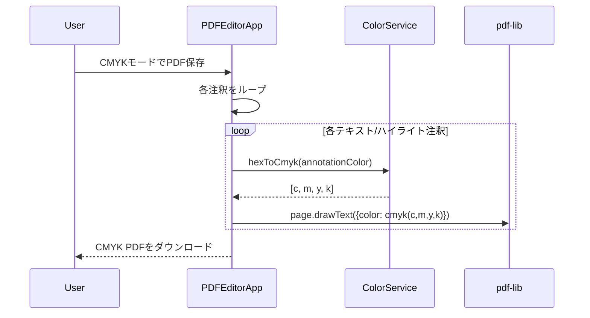

# PDF Editor - 設計書

## 1. アーキテクチャ概要

本アプリケーションは **Manager Pattern** を採用し、各機能領域を専用のManagerクラスに委譲しています。



### Manager責務一覧

| Manager | 責務 |
|---------|------|
| EventManager | イベント統括、キーボード/マウスイベント、ドロップダウン管理 |
| RenderManager | Canvas描画、ズーム制御、ページキャッシュ |
| PageManager | ページ操作（削除、回転、複製、並べ替え） |
| SelectionManager | 複数ページ選択、範囲選択 |
| AnnotationManager | 注釈の描画、ヒット判定、座標変換 |
| ToolbarManager | ツールバーUI状態管理 |
| ContextMenuManager | 右クリックメニュー |
| DragDropManager | ファイル/ページのドラッグ&ドロップ |
| UndoManager | Undo/Redoスタック管理 |
| HelpManager | ヘルプモーダル |
| UndoExecutionManager | Undo/Redo操作の実行（UndoManagerはスタック管理のみ） |
| ExportManager | PDF/画像エクスポート、分割ダウンロード |
| ClipboardManager | 注釈・ページのコピー/ペースト |
| FileOperationManager | PDF/画像ファイルの読み込み |
| CanvasInteractionManager | Canvasマウスイベント、注釈ドラッグ/リサイズ/回転 |

---

## 2. ディレクトリ構成

```
pdfeditor/
├── .claude/
│   └── commands/            # カスタムスラッシュコマンド
│       └── finish.md
├── docs/
│   ├── requirements.md      # 要件定義書
│   ├── design.md            # 設計書（本ファイル）
│   ├── tasks.md             # タスク一覧
│   ├── SESSION_LOG.md       # セッションログ
│   └── walkthrough.md       # ウォークスルー
├── src/
│   ├── main.ts              # アプリケーションエントリー（PDFEditorApp）
│   ├── styles/
│   │   └── index.css        # 全スタイル統合
│   ├── managers/            # 機能別Managerクラス
│   │   ├── EventManager.ts
│   │   ├── RenderManager.ts
│   │   ├── PageManager.ts
│   │   ├── SelectionManager.ts
│   │   ├── AnnotationManager.ts
│   │   ├── ToolbarManager.ts
│   │   ├── ContextMenuManager.ts
│   │   ├── DragDropManager.ts
│   │   ├── UndoManager.ts
│   │   ├── UndoExecutionManager.ts
│   │   ├── ExportManager.ts
│   │   ├── ClipboardManager.ts
│   │   ├── FileOperationManager.ts
│   │   ├── CanvasInteractionManager.ts
│   │   └── HelpManager.ts
│   ├── services/
│   │   ├── PDFService.ts    # PDF操作サービス
│   │   ├── ImageService.ts  # 画像処理サービス
│   │   ├── KeyboardService.ts # キーボードショートカット
│   │   └── StorageService.ts  # セッション保存（IndexedDB）
│   ├── types/
│   │   └── index.ts         # 型定義
│   ├── ui/
│   │   └── icons.ts         # SVGアイコン定義
│   └── utils/
│       └── uuid.ts          # UUID生成
├── index.html               # エントリーポイントHTML
├── package.json
├── tsconfig.json
├── vite.config.ts
├── CLAUDE.md                # Claude Code用ガイド
└── README.md
```

---

## 3. 状態管理

### 3.1 アプリケーション状態

```typescript
interface AppState {
    pages: PageData[];                    // ページ情報一覧
    selectedPageIndex: number;            // 選択中のページインデックス
    selectedPageIndices: number[];        // 複数選択中のページインデックス
    isLoading: boolean;                   // ローディング状態
    isDarkMode: boolean;                  // ダークモード状態
    originalPdfBytes: Uint8Array | null;  // 元PDFのバイトデータ
}
```

### 3.2 ページデータ

```typescript
interface PageData {
    id: string;                  // 一意のID
    type: 'pdf' | 'image';       // ページタイプ
    pdfBytes?: Uint8Array;       // PDF元データ
    imageBytes?: Uint8Array;     // 画像元データ
    thumbnail: string;           // サムネイル画像 (data URL)
    fullImage?: string;          // フルサイズ画像 (data URL, 画像ページ用)
    width: number;               // ページ幅 (pt)
    height: number;              // ページ高さ (pt)
    rotation?: number;           // 回転角度 (0, 90, 180, 270)
    textAnnotations?: TextAnnotation[];        // テキスト注釈
    highlightAnnotations?: HighlightAnnotation[]; // ハイライト注釈
    originalWidth?: number;      // 元画像幅 (px)
    originalHeight?: number;     // 元画像高さ (px)
    originalPageIndex?: number;  // PDF由来のページインデックス
}
```

### 3.3 注釈・操作ログ

```typescript
interface TextAnnotation {
    id: string;
    text: string;
    x: number;
    y: number;
    fontSize: number;
    color: string;
    rotation?: number;  // 回転角度（度、時計回り）
}

interface HighlightAnnotation {
    id: string;
    x: number;
    y: number;
    width: number;
    height: number;
    color: string;
}

// Undo操作の型定義（18種類）
type UndoAction =
    // 単一ページ操作
    | { type: 'deletePage'; page: PageData; index: number }
    | { type: 'movePage'; fromIndex: number; toIndex: number }
    | { type: 'rotatePage'; pageId: string; previousRotation: number; newRotation?: number }
    | { type: 'clear'; pages: PageData[]; selectedIndex: number }
    | { type: 'duplicatePage'; pageId: string; index: number; page?: PageData }
    // 注釈操作
    | { type: 'addText'; pageId: string; annotationId: string; annotation?: TextAnnotation }
    | { type: 'addHighlight'; pageId: string; annotationId: string; annotation?: HighlightAnnotation }
    | { type: 'deleteText'; pageId: string; annotationId: string; annotation: TextAnnotation }
    | { type: 'deleteHighlight'; pageId: string; annotationId: string; annotation: HighlightAnnotation }
    | { type: 'moveText'; pageId: string; annotationId: string; fromX: number; fromY: number; toX: number; toY: number }
    | { type: 'moveHighlight'; pageId: string; annotationId: string; fromX: number; fromY: number; toX: number; toY: number }
    | { type: 'rotateText'; pageId: string; annotationId: string; oldRotation: number; newRotation: number }
    | { type: 'updateText'; pageId: string; annotationId: string; oldText: string; newText: string; oldColor: string; newColor: string; oldFontSize: number; newFontSize: number }
    | { type: 'resizeHighlight'; pageId: string; annotationId: string; oldWidth: number; newWidth: number; oldHeight: number; newHeight: number }
    // 画像操作
    | { type: 'addImage'; pageId: string; index: number; page?: PageData }
    // バッチ操作
    | { type: 'batchMove'; fromIndices: number[]; toIndex: number; movedPageIds: string[] }
    | { type: 'batchRotate'; pageIds: string[]; previousRotations: number[] }
    | { type: 'batchDuplicate'; addedPages: { page: PageData; index: number }[] }
    | { type: 'batchDelete'; deletedPages: { page: PageData; index: number }[] };

```

---

## 4. サービス設計

### 4.1 PDFService

PDFページの読み込み、レンダリング、エクスポートを管理するサービス。

**注意**: `addPDF()`およびファイル読み込み処理は`FileOperationManager`に委譲されています。

```typescript
class PDFService {
    // PDF読み込み（新規）
    async loadPDF(file: File): Promise<LoadResult>;

    // PDFからページ抽出（ArrayBufferコピー対策済み）
    async extractPages(pdfBytes: Uint8Array): Promise<PageData[]>;

    // サムネイル生成
    async renderThumbnail(page: PDFPageProxy, scale: number): Promise<string>;

    // ページをCanvasにレンダリング（統合メソッド）
    async renderToCanvas(canvas: HTMLCanvasElement, pageData: PageData): Promise<void>;

    // PDFページをCanvasに描画（内部実装）
    private async renderPdfPage(canvas: HTMLCanvasElement, pageData: PageData): Promise<void>;

    // 画像ページをCanvasに描画（内部実装）
    private async renderImageToCanvas(canvas: HTMLCanvasElement, pageData: PageData): Promise<void>;

    // 画像をCanvasにフィットさせて描画（センタリング処理）
    private drawImageFitToCanvas(
        canvas: HTMLCanvasElement,
        img: HTMLImageElement,
        pageData: PageData
    ): void;

    // ページ削除
    removePageAt(pages: PageData[], index: number): PageData[];

    // ページ挿入
    insertPageAt(pages: PageData[], page: PageData, index: number): PageData[];

    // ページ並べ替え
    reorderPages(pages: PageData[], fromIndex: number, toIndex: number): PageData[];

    // 画像エクスポート（単一ページ）
    async exportPageAsImage(page: PageData): Promise<Blob>;

    // 一括エクスポート（ZIP）
    async exportAllPagesAsZip(pages: PageData[]): Promise<Blob>;

    // バイナリ分割
    splitBinary(data: Uint8Array, maxSize?: number): Uint8Array[];

    // バイナリ分割してZIPでダウンロード（catコマンドで結合可能）
    async splitBinaryAsZip(pdfBytes: Uint8Array, baseName: string, maxSize?: number): Promise<Blob>;
}
```

### 4.2 ImageService

画像ファイルの処理とPDF埋め込みを管理するサービス。

```typescript
class ImageService {
    // 画像をPageDataに変換（ページサイズにフィット）
    async imageToPageData(
        file: File,
        referenceWidth: number,
        referenceHeight: number
    ): Promise<PageData>;

    // 画像をPDFページとして埋め込む（PDFPageを返す）
    async embedImageToPdf(pdfDoc: PDFDocument, pageData: PageData): Promise<PDFPage>;
}
```

### 4.3 KeyboardService

```typescript
class KeyboardService {
    // キーボードイベントリスナー登録
    init(): void;

    // ショートカット追加
    addShortcut(key: string, modifiers: ('ctrl' | 'meta' | 'shift' | 'alt')[], callback: () => void): void;

    // ショートカット削除
    removeShortcut(key: string, modifiers: ('ctrl' | 'meta' | 'shift' | 'alt')[]): void;

    // クリーンアップ
    destroy(): void;
}
```

### 4.4 StorageService

IndexedDBを使用したセッション永続化サービス。アプリ状態を保存・復元する。

```typescript
class StorageService {
    // セッション状態の保存（IndexedDB）
    async saveState(state: AppState): Promise<void>;

    // セッション状態の復元
    async loadState(): Promise<AppState | null>;

    // セッションのクリア
    async clearState(): Promise<void>;
}
```

### 4.5 RenderManager

Canvasレンダリング、ズーム制御、ページキャッシュを管理するManager。

#### 4.5.1 ページキャッシュ機構

RenderManagerは描画済みのページをキャッシュし、再描画時のパフォーマンスを最適化する。

```typescript
class RenderManager {
    private pageCache: Map<string, HTMLCanvasElement> = new Map();

    // キャッシュキー生成（pageId + rotation）
    private getCacheKey(pageId: string, rotation: number): string;

    // キャッシュをクリア
    clearCache(): void;

    // キャッシュされた背景を使って再描画
    redrawWithCachedBackground(): void;

    // ビューポートに最適なスケール計算
    calculateFitScale(): number;

    // PDFページをレンダリング
    private async renderPdfPage(pageData: PageData, canvas: HTMLCanvasElement, scale: number): Promise<void>;

    // 画像ページをレンダリング
    private async renderImagePage(pageData: PageData, canvas: HTMLCanvasElement, scale: number): Promise<void>;
}
```

**キャッシュ戦略**:
- キャッシュキー: `${pageId}_${rotation}`
- キャッシュ無効化タイミング: ページ回転時、ページ削除時
- 注釈は毎回再描画（キャッシュには含まれない）

### 4.6 SelectionManager

複数ページ選択、範囲選択を管理するManager。

```typescript
class SelectionManager {
    // 単一ページを選択
    select(pageIndex: number, multiSelect: boolean = false): void;

    // 範囲選択（Shift+Click）
    selectRange(startIndex: number, endIndex: number): void;

    // 全ページ選択
    selectAll(): void;

    // 選択をクリア
    clear(): void;

    // 指定ページが選択されているか判定
    isSelected(pageIndex: number): boolean;
}
```

**選択動作**:
- 通常クリック: 単一選択
- Ctrl/Cmd + クリック: 複数選択（トグル）
- Shift + クリック: 範囲選択

### 4.7 AnnotationManager

テキスト・ハイライト注釈の描画、ヒット判定、座標変換を管理するManager。

#### 4.7.1 座標変換

PDFの座標系（左下原点）とCanvasの座標系（左上原点）を変換する。

```typescript
class AnnotationManager {
    // PDF座標系 → Canvas座標系
    private toCanvasPoint(
        pdfX: number,
        pdfY: number,
        pageHeight: number,
        scale: number
    ): { x: number; y: number };

    // Canvas座標系 → PDF座標系
    private toPdfPoint(
        canvasX: number,
        canvasY: number,
        pageHeight: number,
        scale: number
    ): { x: number; y: number };
}
```

#### 4.7.2 ヒット判定

マウス/タッチ座標から注釈・ハンドルのヒット判定を行う。

```typescript
class AnnotationManager {
    // テキスト注釈のヒット判定
    private hitTestText(
        annotation: TextAnnotation,
        x: number,
        y: number,
        scale: number
    ): boolean;

    // テキストのリサイズハンドルヒット判定
    private hitTestTextHandle(
        annotation: TextAnnotation,
        x: number,
        y: number,
        scale: number
    ): boolean;

    // テキストの回転ハンドルヒット判定
    private hitTestTextRotationHandle(
        annotation: TextAnnotation,
        x: number,
        y: number,
        scale: number
    ): boolean;

    // ハイライトのヒット判定
    private hitTestHighlight(
        annotation: HighlightAnnotation,
        x: number,
        y: number,
        scale: number
    ): boolean;

    // ハイライトのリサイズハンドルヒット判定
    private hitTestHighlightHandle(
        annotation: HighlightAnnotation,
        x: number,
        y: number,
        scale: number
    ): 'topLeft' | 'topRight' | 'bottomLeft' | 'bottomRight' | null;
}
```

#### 4.7.3 描画メソッド

```typescript
class AnnotationManager {
    // すべての注釈を描画
    drawAnnotations(
        ctx: CanvasRenderingContext2D,
        pageData: PageData,
        scale: number
    ): void;

    // ハイライト注釈を描画
    private drawHighlight(
        ctx: CanvasRenderingContext2D,
        annotation: HighlightAnnotation,
        scale: number,
        isSelected: boolean
    ): void;

    // テキスト注釈を描画
    private drawText(
        ctx: CanvasRenderingContext2D,
        annotation: TextAnnotation,
        scale: number,
        isSelected: boolean
    ): void;

    // リサイズ/回転ハンドルを描画
    private drawHandle(
        ctx: CanvasRenderingContext2D,
        x: number,
        y: number,
        color: string
    ): void;
}
```

---

## 5. UI設計

### 5.1 レイアウト

```
+------------------------------------------------------------------+
|  [開く] [保存] [分割] [画像] [上へ] [下へ] [画像] [全保存]  [🌙 Theme]  |  ← Toolbar
+------------------+-----------------------------------------------+
|                  |                                               |
|  +-----------+   |   [ファイルを開く]                            |
|  | Page 1    |   |                                               |
|  +-----------+   |   またはファイルをドロップ                      |
|  | Page 2    |   |                                               |
|  +-----------+   |             (Empty State)                     |
|     (選択中)      |                                               |
|  +-----------+   |                                               |
|  | Page 3    |   |                                               |
|  +-----------+   |                                               |
|                  |                                               |
|  [ドロップゾーン]  |                                               |
|                  |                                               |
+------------------+-----------------------------------------------+
      Sidebar (180px)                    MainView (flex: 1)
```

### 5.2 カラースキーム

```css
/* ライトモード */
:root {
    --bg-primary: #ffffff;
    --bg-secondary: #f5f5f7;
    --bg-tertiary: #e8e8ed;
    --text-primary: #1d1d1f;
    --text-secondary: #6e6e73;
    --accent: #007aff;
    --border: #d2d2d7;
}

/* ダークモード */
:root.dark {
    --bg-primary: #1c1c1e;
    --bg-secondary: #2c2c2e;
    --bg-tertiary: #3a3a3c;
    --text-primary: #f5f5f7;
    --text-secondary: #98989d;
    --accent: #0a84ff;
    --border: #38383a;
}
```

---

## 6. キーボードショートカット

| ショートカット | 動作 | プラットフォーム |
|----------------|------|------------------|
| `Ctrl + O` | PDFを開く | Windows |
| `Cmd + O` | PDFを開く | Mac |
| `Ctrl + S` | PDFを保存 | Windows |
| `Cmd + S` | PDFを保存 | Mac |
| `Ctrl + D` | 選択ページ削除 | Windows |
| `Cmd + D` | 選択ページ削除 | Mac |
| `Ctrl + Z` | Undo | Windows |
| `Cmd + Z` | Undo | Mac |
| `Ctrl + Y` | Redo | Windows |
| `Cmd + Shift + Z` | Redo | Mac |
| `Ctrl + A` | 全ページ選択 | Windows |
| `Cmd + A` | 全ページ選択 | Mac |
| `Ctrl + C` | コピー（注釈） | Windows |
| `Cmd + C` | コピー（注釈） | Mac |
| `Ctrl + V` | 貼り付け（注釈） | Windows |
| `Cmd + V` | 貼り付け（注釈） | Mac |
| `Ctrl + +` | ズームイン | Windows |
| `Cmd + +` | ズームイン | Mac |
| `Ctrl + -` | ズームアウト | Windows |
| `Cmd + -` | ズームアウト | Mac |
| `Ctrl + 0` | ズームリセット | Windows |
| `Cmd + 0` | ズームリセット | Mac |
| `Delete` / `Backspace` | 選択した注釈を削除 | 共通 |
| `Space + ドラッグ` | パン（移動） | 共通 |
| `↑` | 前のページを選択 | 共通 |
| `↓` | 次のページを選択 | 共通 |

---

## 7. 処理フロー

### 7.1 PDF読み込みフロー



### 7.2 画像挿入フロー



---

## 8. エラーハンドリング

| エラー種別 | 対応 |
|------------|------|
| 非対応ファイル形式 | トースト通知で警告表示 |
| PDF読み込み失敗 | エラーメッセージ表示 |
| 画像処理失敗 | エラーメッセージ表示 |
| ArrayBuffer detachment | 事前にslice()でコピー |

---

## 9. 外部依存関係

```json
{
    "dependencies": {
        "pdf-lib": "^1.17.1",
        "pdfjs-dist": "^4.10.38"
    },
    "devDependencies": {
        "typescript": "~5.6.2",
        "vite": "^6.0.5"
    }
}
```

---

## 10. 既知の制約・注意点

- **ArrayBuffer detachment**: pdfjs-distはWorkerにArrayBufferを転送するとdetachされるため、事前にslice()でコピーが必要
- **暗号化PDF**: 非対応
- **大容量ファイル**: 100MB以上のPDFはパフォーマンス保証外

---

## 11. バイナリ分割機能

メール添付の容量制限（10MB）に対応するための機能。

### 11.1 処理フロー



### 11.2 受信側での結合方法

**Linux/Mac:**
```bash
cat document.pdf.* > document.pdf
```

**Windows (コマンドプロンプト):**
```cmd
copy /b document.pdf.001+document.pdf.002+document.pdf.003 document.pdf
```

**Windows (PowerShell):**
```powershell
Get-Content document.pdf.* -Encoding Byte -ReadCount 0 | Set-Content document.pdf -Encoding Byte
```

---

## 12. モバイル対応

### 12.1 タッチイベント処理

EventManagerがモバイルデバイスでのタッチ操作を管理する。

```typescript
class EventManager {
    // モバイルサイドバーの初期化
    private setupMobileSidebar(): void;

    // サイドバーのスワイプジェスチャ
    private setupSidebarSwipe(): void;

    // タッチイベントハンドラ
    private setupTouchEvents(): void;

    // タッチによるパン操作
    private setupTouchPanning(): void;

    // 2点タッチ間の距離計算（ピンチズーム用）
    private getTouchDistance(touch1: Touch, touch2: Touch): number;

    // 2点タッチの中心座標計算
    private getTouchCenter(touch1: Touch, touch2: Touch): { x: number; y: number };
}
```

### 12.2 実装されたジェスチャ

| ジェスチャ | 動作 |
|-----------|------|
| **シングルタップ** | ページ選択、注釈選択 |
| **ロングプレス** | コンテキストメニュー表示 |
| **ピンチイン/アウト** | ズームイン/ズームアウト |
| **2本指スワイプ** | キャンバスパン（移動） |
| **サイドバースワイプ** | サイドバーの開閉 |
| **ドラッグ&ドロップ** | ページ並べ替え |

### 12.3 レスポンシブUI

画面幅に応じてレイアウトが変化する。

```css
/* モバイルビュー (< 768px) */
@media (max-width: 768px) {
    .sidebar {
        position: fixed;
        transform: translateX(-100%);
        transition: transform 0.3s;
    }

    .sidebar.open {
        transform: translateX(0);
    }

    .mobile-menu-button {
        display: block;
    }
}
```

**UI調整**:
- サイドバーは初期状態で非表示
- ハンバーガーメニューでトグル
- ツールバーボタンのサイズを大きく（タップしやすく）
- 注釈のハンドルサイズを大きく（12px → 16px）

### 12.4 モバイル固有の型定義

```typescript
interface UIElements {
    // ... 既存のプロパティ

    // モバイル用UI
    mobileMenuButton?: HTMLButtonElement;
    mobileOverlay?: HTMLDivElement;
}
```

---

## 13. 型定義補足

### 13.1 UIElements

アプリケーション内で使用されるすべてのUI要素への参照。

```typescript
interface UIElements {
    // コンテナ
    sidebar: HTMLElement;
    mainView: HTMLElement;
    toolbar: HTMLElement;

    // キャンバス
    canvas: HTMLCanvasElement;

    // サムネイルリスト
    thumbnailList: HTMLElement;

    // ファイル入力
    fileInput: HTMLInputElement;

    // ツールバーボタン
    openButton: HTMLButtonElement;
    saveButton: HTMLButtonElement;
    splitButton: HTMLButtonElement;
    addPdfButton: HTMLButtonElement;
    exportImageButton: HTMLButtonElement;
    exportAllButton: HTMLButtonElement;
    themeToggleButton: HTMLButtonElement;
    helpButton: HTMLButtonElement;

    // 注釈コントロール
    addTextButton: HTMLButtonElement;
    addHighlightButton: HTMLButtonElement;

    // ドロップダウン
    pageDropdown: HTMLElement;

    // モバイルUI
    mobileMenuButton?: HTMLButtonElement;
    mobileOverlay?: HTMLDivElement;
}
```

### 13.2 MenuItem

コンテキストメニューの項目定義。

```typescript
interface MenuItem {
    label: string;           // 表示ラベル
    icon?: string;          // SVGアイコン（オプション）
    action: () => void;     // クリック時のコールバック
    separator?: boolean;    // 区切り線
    disabled?: boolean;     // 無効化フラグ
}
```

### 13.3 AppAction

アプリケーション全体で発生するアクションの型。

```typescript
type AppAction =
    | 'openFile'
    | 'saveFile'
    | 'addPdf'
    | 'deletePage'
    | 'duplicatePage'
    | 'rotatePage'
    | 'movePage'
    | 'addText'
    | 'addHighlight'
    | 'deleteAnnotation'
    | 'undo'
    | 'redo'
    | 'selectAll'
    | 'clearSelection'
    | 'exportImage'
    | 'exportAllImages'
    | 'splitPdf'
    | 'toggleTheme'
    | 'showHelp';
```

---

## 14. PageManager詳細

PageManagerは複数ページのバッチ操作をサポートする。

```typescript
class PageManager {
    // 単一ページ削除
    deletePage(index: number): void;

    // 複数ページ削除（バッチ）
    deletePages(indices: number[]): void;

    // ページ回転
    rotatePage(index: number, degrees: number): void;

    // 複数ページ回転（バッチ）
    rotatePages(indices: number[], degrees: number): void;

    // ページ複製
    duplicatePage(index: number): void;

    // 複数ページ複製（バッチ）
    duplicatePages(indices: number[]): void;

    // 複数ページの移動
    movePages(fromIndices: number[], toIndex: number): void;

    // 削除後の選択状態復元
    private restoreSelectionAfterDelete(deletedIndices: number[]): void;
}
```

**バッチ操作の特徴**:
- 複数選択状態での操作を一度に実行
- Undo/Redoは1回の操作として記録
- 選択状態は操作後も維持（可能な限り）

---

## 15. まとめ

本アプリケーションは**Manager Pattern**を採用し、各機能領域を疎結合に保つことで保守性を高めている。

**設計の特徴**:
- **クライアント完結**: すべての処理がブラウザ内で完結（プライバシー保護）
- **イベント駆動**: EventManagerが各Managerを協調動作させる
- **キャッシュ最適化**: RenderManagerがページキャッシュでパフォーマンス向上
- **モバイルファースト**: タッチ操作、レスポンシブUI対応
- **Undo/Redo完備**: すべての操作がUndoManager経由で記録される
- **型安全性**: TypeScriptによる厳格な型定義

---

## 16. CMYK変換機能

商業印刷に必要なCMYKカラースペースへの変換機能を提供する。

### 16.1 アーキテクチャ

```mermaid
graph LR
    A[RGB画像/注釈] --> B[ColorService]
    B --> C[CMYK値]
    C --> D[pdf-lib cmyk()]
    D --> E[CMYK PDF出力]

    B --> F[CMYK→RGBシミュレート]
    F --> G[Canvas描画プレビュー]
```

### 16.2 ColorService

RGB↔CMYK変換を担当するサービスクラス。

```typescript
class ColorService {
    // RGB (0-255) → CMYK (0-1)
    static rgbToCmyk(r: number, g: number, b: number): [number, number, number, number];

    // CMYK (0-1) → RGB (0-255) - プレビュー用
    static cmykToRgb(c: number, m: number, y: number, k: number): [number, number, number];

    // HEX文字列 → CMYK
    static hexToCmyk(hex: string): [number, number, number, number];

    // CMYK → HEX文字列
    static cmykToHex(c: number, m: number, y: number, k: number): string;

    // ガマット警告判定
    static isOutOfGamut(r: number, g: number, b: number): boolean;
}
```

**依存ライブラリ**: `color-convert` (RGB↔CMYK変換)

### 16.3 CMYK変換のフロー



### 16.4 UI

**CMYKモード切り替え**: ファイルメニューのドロップダウン内にチェックボックスを配置。

```html
<label class="dropdown-item dropdown-item-checkbox">
    <input type="checkbox" id="cmyk-mode-toggle">
    <span>CMYKモード (印刷用)</span>
</label>
```

### 16.5 制約事項

| 項目 | 制約 |
|------|------|
| **画像のCMYK変換** | Canvas経由でラスタライズが必要（品質低下の可能性） |
| **ブラウザプレビュー** | RGBシミュレートのみ（真のCMYKプレビューは不可） |
| **ICCプロファイル** | 将来対応（現時点では固定変換式） |

### 16.6 技術スタック

| コンポーネント | 技術 |
|----------------|------|
| **色変換** | color-convert (RGB↔CMYK) |
| **PDF出力** | pdf-lib の `cmyk()` 関数 |
| **UI** | ネイティブHTML `<input type="checkbox">` |

### 16.7 将来の拡張

- ICCプロファイル対応（Phase 36以降で検討）
- ガマット警告のビジュアル表示
- CMYKプレビューの精度向上
