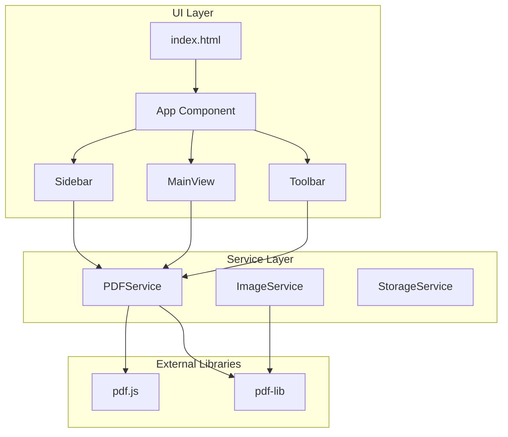
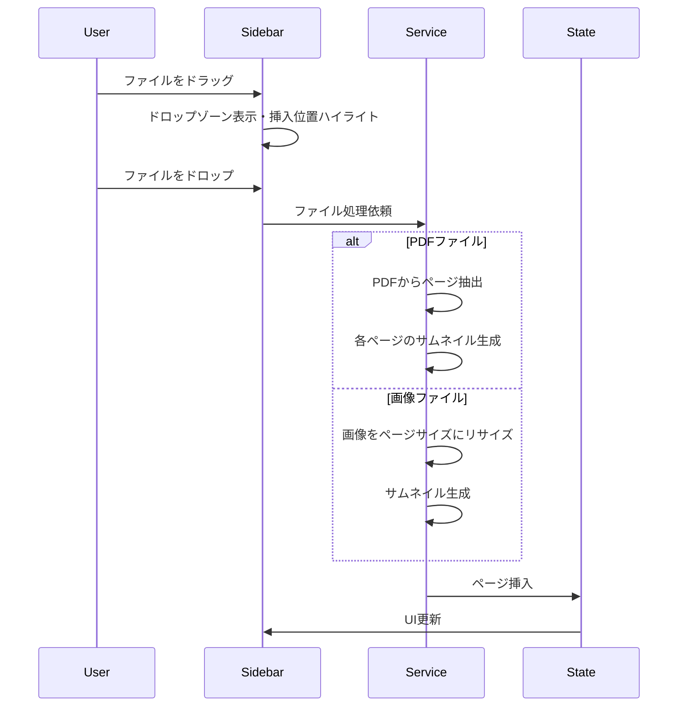

# PDF Editor - 設計書

## 1. アーキテクチャ概要



---

## 2. ディレクトリ構成

```
pdfeditor/
├── docs/
│   ├── requirements.md      # 要件定義書
│   ├── design.md            # 設計書（本ファイル）
│   └── tasks.md             # タスク一覧
├── src/
│   ├── index.html           # エントリーポイントHTML
│   ├── main.ts              # アプリケーションエントリー
│   ├── styles/
│   │   ├── index.css        # グローバルスタイル
│   │   ├── variables.css    # CSS変数定義
│   │   ├── sidebar.css      # サイドバースタイル
│   │   └── main-view.css    # メインビュースタイル
│   ├── components/
│   │   ├── Sidebar.ts       # サイドバーコンポーネント
│   │   ├── PageThumbnail.ts # サムネイルコンポーネント
│   │   ├── MainView.ts      # メインビューコンポーネント
│   │   └── Toolbar.ts       # ツールバーコンポーネント
│   ├── services/
│   │   ├── PDFService.ts    # PDF操作サービス
│   │   ├── ImageService.ts  # 画像処理サービス
│   │   └── KeyboardService.ts # キーボードショートカット
│   ├── types/
│   │   └── index.ts         # 型定義
│   └── utils/
│       └── helpers.ts       # ヘルパー関数
├── public/
│   └── favicon.ico
├── package.json
├── tsconfig.json
├── vite.config.ts
└── README.md
```

---

## 3. コンポーネント設計

### 3.1 状態管理

```typescript
// アプリケーション状態
interface AppState {
  pdfDocument: PDFDocumentProxy | null;  // 読み込んだPDF
  pages: PageData[];                      // ページ情報一覧
  selectedPageIndex: number;              // 選択中のページインデックス
  isLoading: boolean;                     // ローディング状態
  isDarkMode: boolean;                    // ダークモード状態
}

// ページデータ
interface PageData {
  id: string;                  // 一意のID
  type: 'pdf' | 'image';       // ページタイプ
  originalSource: Uint8Array;  // 元データ
  thumbnail: string;           // サムネイル画像URL (data URL)
  width: number;               // ページ幅
  height: number;              // ページ高さ
}
```

### 3.2 Sidebar コンポーネント

**責務:**
- ページサムネイル一覧の表示
- ドラッグ＆ドロップによるファイル受付
- ページ選択のハンドリング
- ページ順序の並べ替え（ドラッグ）

**イベント:**
- `onPageSelect(index: number)` - ページ選択時
- `onFileDrop(files: FileList, insertIndex: number)` - ファイルドロップ時
- `onPageReorder(fromIndex: number, toIndex: number)` - 並べ替え時

### 3.3 MainView コンポーネント

**責務:**
- 選択中ページの拡大表示
- ページ送り機能

**プロパティ:**
- `currentPage: PageData` - 表示中のページ

### 3.4 Toolbar コンポーネント

**責務:**
- ファイル読み込みボタン
- PDF出力ボタン
- ダークモード切り替え

---

## 4. サービス設計

### 4.1 PDFService

```typescript
class PDFService {
  // PDF読み込み
  async loadPDF(file: File): Promise<PageData[]>;
  
  // PDFからページ抽出
  async extractPages(pdfBytes: Uint8Array): Promise<PageData[]>;
  
  // サムネイル生成
  async renderThumbnail(page: PDFPageProxy, scale: number): Promise<string>;
  
  // ページ削除
  removePageAt(pages: PageData[], index: number): PageData[];
  
  // ページ挿入
  insertPageAt(pages: PageData[], page: PageData, index: number): PageData[];
  
  // ページ並べ替え
  reorderPages(pages: PageData[], fromIndex: number, toIndex: number): PageData[];
  
  // PDF出力
  async exportPDF(pages: PageData[]): Promise<Uint8Array>;
}
```

### 4.2 ImageService

```typescript
class ImageService {
  // 画像をPDFページサイズにリサイズ
  async resizeToPageSize(
    imageFile: File, 
    targetWidth: number, 
    targetHeight: number
  ): Promise<Uint8Array>;
  
  // 画像をPDFページとして追加
  async imageToPageData(
    imageFile: File,
    referenceWidth: number,
    referenceHeight: number
  ): Promise<PageData>;
}
```

### 4.3 KeyboardService

```typescript
class KeyboardService {
  private shortcuts: Map<string, () => void>;
  
  // キーボードイベントのリスナー登録
  registerShortcuts(): void;
  
  // ショートカット追加
  addShortcut(key: string, modifiers: string[], callback: () => void): void;
  
  // クリーンアップ
  destroy(): void;
}
```

---

## 5. UI設計

### 5.1 レイアウト

```
+------------------------------------------------------------------+
|  [📄 開く]  [💾 保存]                               [🌙 Dark Mode]  |  ← Toolbar
+------------------+-----------------------------------------------+
|                  |                                               |
|  +-----------+   |                                               |
|  | Page 1    |   |                                               |
|  +-----------+   |                                               |
|                  |                                               |
|  +-----------+   |          選択中ページの                        |
|  | Page 2    |   |          大きなプレビュー                       |
|  +-----------+   |                                               |
|     (選択中)      |                                               |
|  +-----------+   |                                               |
|  | Page 3    |   |                                               |
|  +-----------+   |                                               |
|                  |                                               |
|  [ドロップゾーン]  |                                               |
|                  |                                               |
+------------------+-----------------------------------------------+
      Sidebar                      MainView
     (250px固定)                  (flex: 1)
```

### 5.2 カラースキーム

```css
/* ライトモード */
:root {
  --bg-primary: #ffffff;
  --bg-secondary: #f5f5f7;
  --bg-tertiary: #e8e8ed;
  --text-primary: #1d1d1f;
  --text-secondary: #6e6e73;
  --accent: #007aff;
  --border: #d2d2d7;
}

/* ダークモード */
:root.dark {
  --bg-primary: #1c1c1e;
  --bg-secondary: #2c2c2e;
  --bg-tertiary: #3a3a3c;
  --text-primary: #f5f5f7;
  --text-secondary: #98989d;
  --accent: #0a84ff;
  --border: #38383a;
}
```

---

## 6. キーボードショートカット

| ショートカット | 動作 | プラットフォーム |
|----------------|------|------------------|
| `Ctrl + D` | 選択ページ削除 | Windows |
| `Cmd + D` | 選択ページ削除 | Mac |
| `Ctrl + O` | PDFを開く | Windows |
| `Cmd + O` | PDFを開く | Mac |
| `Ctrl + S` | PDFを保存 | Windows |
| `Cmd + S` | PDFを保存 | Mac |
| `↑` / `↓` | ページ選択移動 | 共通 |

---

## 7. ドラッグ＆ドロップ処理フロー



---

## 8. エラーハンドリング

| エラー種別 | 対応 |
|------------|------|
| 非対応ファイル形式 | トースト通知で警告表示 |
| 暗号化PDF | エラーメッセージ表示 |
| ファイル読み込み失敗 | リトライ可能なエラー表示 |
| メモリ不足 | 警告とページ数制限の提案 |

---

## 9. 外部依存関係

```json
{
  "dependencies": {
    "pdf-lib": "^1.17.1",
    "pdfjs-dist": "^4.0.379"
  },
  "devDependencies": {
    "typescript": "^5.3.3",
    "vite": "^5.0.10"
  }
}
```
