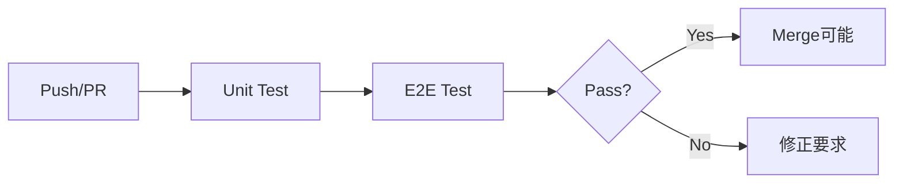

# Phase 40: 自動テストの導入 - 実装計画

> **作成日**: 2026-01-15  
> **Phase**: 40  
> **目的**: Vitest / Playwright によるテスト自動化で品質を担保する

---

## 1. 概要

### 1.1 背景

現在のPDFエディタは手動検証のみで品質を確認している。
コードレビュー (`/review`) でコードは綺麗になるが、「結合時に他の機能が壊れていないか」を確認する自動化が必要。

### 1.2 ゴール

- ✅ ユニットテスト環境の構築 (Vitest)
- ✅ 主要ロジックのテストカバレッジ確保
- ✅ E2Eテスト環境の構築 (Playwright)
- ✅ 主要ユーザーフローの自動検証
- ✅ CI/CD連携 (GitHub Actions)

---

## 2. 技術選定

### 2.1 フレームワーク比較

| 項目 | Vitest | Playwright |
|------|--------|------------|
| 用途 | ユニットテスト / ロジックテスト | E2Eテスト / ブラウザテスト |
| 速度 | 高速 (Vite統合) | 中速 (ブラウザ起動あり) |
| カバレッジ | ロジック層 | UI/UX層 |
| 学習コスト | 低 (Jest互換) | 中 |

### 2.2 採用方針

**両方採用** - 役割分担で使い分け

```
┌─────────────────────────────────────────────┐
│                    E2E (Playwright)          │
│   - PDF読み込み → 編集 → 保存フロー         │
│   - ページ操作の統合テスト                   │
│   - UI操作の回帰テスト                       │
├─────────────────────────────────────────────┤
│               Unit (Vitest)                  │
│   - ColorService (RGB↔CMYK変換)             │
│   - PDFService (ページ操作ロジック)         │
│   - UndoManager (Undo/Redoスタック)         │
└─────────────────────────────────────────────┘
```

---

## 3. 実装計画

### 3.1 ディレクトリ構成

```
pdfeditor/
├── src/
├── tests/
│   ├── unit/                    # Vitestユニットテスト
│   │   ├── services/
│   │   │   ├── ColorService.test.ts
│   │   │   ├── PDFService.test.ts
│   │   │   └── ImageService.test.ts
│   │   └── managers/
│   │       ├── UndoManager.test.ts
│   │       └── SelectionManager.test.ts
│   ├── e2e/                     # Playwright E2Eテスト
│   │   ├── pdf-load.spec.ts
│   │   ├── page-operations.spec.ts
│   │   ├── annotations.spec.ts
│   │   └── export.spec.ts
│   └── fixtures/                # テスト用サンプルファイル
│       ├── sample.pdf           # 1ページのシンプルなPDF
│       └── sample.png           # 200x200px のテスト画像
├── vitest.config.ts
├── playwright.config.ts
└── package.json
```

#### テスト用 fixtures ファイルの準備

**sample.pdf の作成方法**:

```bash
# 方法1: pdf-lib を使って Node.js スクリプトで生成
npx ts-node scripts/create-test-pdf.ts

# 方法2: 手動で作成
# - 任意のアプリで1ページのPDFを作成
# - 内容: "Test Page" というテキストのみ
# - サイズ: A4 (612×792pt)
```

**[NEW] `scripts/create-test-pdf.ts`** (オプション):

```typescript
import { PDFDocument, StandardFonts, rgb } from 'pdf-lib';
import fs from 'fs';

async function createTestPdf() {
    const pdfDoc = await PDFDocument.create();
    const page = pdfDoc.addPage([612, 792]); // A4 サイズ
    const font = await pdfDoc.embedFont(StandardFonts.Helvetica);
    
    page.drawText('Test Page for E2E Testing', {
        x: 50,
        y: 700,
        size: 24,
        font,
        color: rgb(0, 0, 0),
    });
    
    const pdfBytes = await pdfDoc.save();
    fs.writeFileSync('tests/fixtures/sample.pdf', pdfBytes);
    console.log('Created tests/fixtures/sample.pdf');
}

createTestPdf();
```

**sample.png の作成方法**:

```bash
# ImageMagick を使用
magick -size 200x200 xc:blue tests/fixtures/sample.png

# または任意の画像エディタで 200x200px の PNG を作成
```

---

### 3.2 Vitest セットアップ

#### インストール

```bash
npm install -D vitest @vitest/coverage-v8 @vitest/ui happy-dom
```

#### [NEW] `vitest.config.ts`

```typescript
import { defineConfig } from 'vitest/config';

export default defineConfig({
    test: {
        globals: true,
        environment: 'happy-dom',  // DOM環境をシミュレート
        include: ['tests/unit/**/*.test.ts'],
        coverage: {
            provider: 'v8',
            reporter: ['text', 'html'],
            include: ['src/services/**', 'src/managers/**'],
        },
    },
});
```

#### [MODIFY] `package.json`

```json
{
    "scripts": {
        "test": "vitest",
        "test:ui": "vitest --ui",
        "test:coverage": "vitest run --coverage"
    }
}
```

---

### 3.3 Playwright セットアップ

#### インストール

```bash
npm install -D @playwright/test
npx playwright install
```

#### [NEW] `playwright.config.ts`

```typescript
import { defineConfig, devices } from '@playwright/test';

export default defineConfig({
    testDir: './tests/e2e',
    fullyParallel: true,
    forbidOnly: !!process.env.CI,
    retries: process.env.CI ? 2 : 0,
    workers: process.env.CI ? 1 : undefined,
    reporter: 'html',
    use: {
        baseURL: 'http://localhost:5173',
        trace: 'on-first-retry',
    },
    projects: [
        { name: 'chromium', use: { ...devices['Desktop Chrome'] } },
        { name: 'firefox', use: { ...devices['Desktop Firefox'] } },
    ],
    webServer: {
        command: 'npm run dev',
        url: 'http://localhost:5173',
        reuseExistingServer: !process.env.CI,
    },
});
```

#### [MODIFY] `package.json`

```json
{
    "scripts": {
        "test:e2e": "playwright test",
        "test:e2e:ui": "playwright test --ui"
    }
}
```

---

### 3.4 サンプルテストコード

#### [NEW] `tests/unit/services/ColorService.test.ts`

```typescript
import { describe, it, expect } from 'vitest';
import { ColorService } from '../../../src/services/ColorService';

describe('ColorService', () => {
    describe('rgbToCmyk', () => {
        it('純粋な赤を正しく変換する', () => {
            const [c, m, y, k] = ColorService.rgbToCmyk(255, 0, 0);
            expect(c).toBeCloseTo(0, 1);
            expect(m).toBeCloseTo(1, 1);
            expect(y).toBeCloseTo(1, 1);
            expect(k).toBeCloseTo(0, 1);
        });

        it('純粋な黒を正しく変換する', () => {
            const [c, m, y, k] = ColorService.rgbToCmyk(0, 0, 0);
            expect(k).toBeCloseTo(1, 1);
        });

        it('純粋な白を正しく変換する', () => {
            const [c, m, y, k] = ColorService.rgbToCmyk(255, 255, 255);
            expect(c).toBeCloseTo(0, 1);
            expect(m).toBeCloseTo(0, 1);
            expect(y).toBeCloseTo(0, 1);
            expect(k).toBeCloseTo(0, 1);
        });
    });

    describe('hexToCmyk', () => {
        it('HEX文字列を正しく変換する', () => {
            const [c, m, y, k] = ColorService.hexToCmyk('#FF0000');
            expect(m).toBeCloseTo(1, 1);
        });

        it('#なしのHEX文字列も処理できる', () => {
            const [c, m, y, k] = ColorService.hexToCmyk('00FF00');
            expect(c).toBeCloseTo(1, 1);
        });
    });
});
```

#### [NEW] `tests/unit/services/PDFService.test.ts`

> [!NOTE]
> PDFService は pdf.js を使用するため、モックが必要です。

```typescript
import { describe, it, expect, vi, beforeEach } from 'vitest';
import { PDFService } from '../../../src/services/PDFService';
import type { PageData } from '../../../src/types';

// pdfjs-dist のモック
vi.mock('pdfjs-dist', () => ({
    getDocument: vi.fn(),
    GlobalWorkerOptions: { workerSrc: '' }
}));

describe('PDFService', () => {
    let pdfService: PDFService;

    // テスト用のダミーページデータ
    const createMockPage = (id: string, index: number): PageData => ({
        id,
        type: 'pdf',
        thumbnail: 'data:image/png;base64,xxx',
        width: 612,
        height: 792,
        originalPageIndex: index,
    });

    beforeEach(() => {
        pdfService = new PDFService();
    });

    describe('removePageAt', () => {
        it('指定したインデックスのページを削除する', () => {
            const pages = [
                createMockPage('page-0', 0),
                createMockPage('page-1', 1),
                createMockPage('page-2', 2),
            ];
            
            const result = pdfService.removePageAt(pages, 1);
            
            expect(result.length).toBe(2);
            expect(result[0].id).toBe('page-0');
            expect(result[1].id).toBe('page-2');
        });

        it('範囲外のインデックスでは何もしない', () => {
            const pages = [createMockPage('page-0', 0)];
            const result = pdfService.removePageAt(pages, 5);
            expect(result.length).toBe(1);
        });
    });

    describe('insertPageAt', () => {
        it('指定したインデックスにページを挿入する', () => {
            const pages = [
                createMockPage('page-0', 0),
                createMockPage('page-2', 2),
            ];
            const newPage = createMockPage('page-1', 1);
            
            const result = pdfService.insertPageAt(pages, newPage, 1);
            
            expect(result.length).toBe(3);
            expect(result[1].id).toBe('page-1');
        });
    });

    describe('reorderPages', () => {
        it('ページを正しく並べ替える', () => {
            const pages = [
                createMockPage('page-0', 0),
                createMockPage('page-1', 1),
                createMockPage('page-2', 2),
            ];
            
            const result = pdfService.reorderPages(pages, 0, 2);
            
            expect(result[0].id).toBe('page-1');
            expect(result[1].id).toBe('page-2');
            expect(result[2].id).toBe('page-0');
        });
    });
});
```

#### [NEW] `tests/unit/managers/UndoManager.test.ts`

```typescript
import { describe, it, expect, beforeEach } from 'vitest';
import { UndoManager } from '../../../src/managers/UndoManager';
import type { PageData } from '../../../src/types';

describe('UndoManager', () => {
    let undoManager: UndoManager;

    // テスト用のダミーページデータ
    const mockPage: PageData = {
        id: 'test-page-1',
        type: 'pdf',
        thumbnail: 'data:image/png;base64,xxx',
        width: 612,
        height: 792,
    };

    beforeEach(() => {
        undoManager = new UndoManager();
    });

    it('初期状態ではundoできない', () => {
        expect(undoManager.canUndo()).toBe(false);
    });

    it('初期状態ではredoできない', () => {
        expect(undoManager.canRedo()).toBe(false);
    });

    it('pushするとundoできるようになる', () => {
        undoManager.push({ type: 'deletePage', page: mockPage, index: 0 });
        expect(undoManager.canUndo()).toBe(true);
    });

    it('popUndoするとredoできるようになる', () => {
        undoManager.push({ type: 'deletePage', page: mockPage, index: 0 });
        const action = undoManager.popUndo();
        expect(action).toBeDefined();
        expect(action?.type).toBe('deletePage');
        expect(undoManager.canRedo()).toBe(true);
    });

    it('popRedoするとundoスタックに戻る', () => {
        undoManager.push({ type: 'deletePage', page: mockPage, index: 0 });
        undoManager.popUndo();
        expect(undoManager.canUndo()).toBe(false);
        
        const action = undoManager.popRedo();
        expect(action).toBeDefined();
        expect(undoManager.canUndo()).toBe(true);
    });

    it('clearするとスタックが空になる', () => {
        undoManager.push({ type: 'deletePage', page: mockPage, index: 0 });
        undoManager.push({ type: 'movePage', fromIndex: 0, toIndex: 1 });
        undoManager.clear();
        expect(undoManager.canUndo()).toBe(false);
        expect(undoManager.canRedo()).toBe(false);
    });

    it('新しいpushでredoスタックがクリアされる', () => {
        undoManager.push({ type: 'deletePage', page: mockPage, index: 0 });
        undoManager.popUndo();
        expect(undoManager.canRedo()).toBe(true);
        
        undoManager.push({ type: 'movePage', fromIndex: 0, toIndex: 1 });
        expect(undoManager.canRedo()).toBe(false);
    });

    it('maxStackSizeを超えると古いアクションが削除される', () => {
        const smallManager = new UndoManager(3);
        smallManager.push({ type: 'deletePage', page: { ...mockPage, id: '1' }, index: 0 });
        smallManager.push({ type: 'deletePage', page: { ...mockPage, id: '2' }, index: 1 });
        smallManager.push({ type: 'deletePage', page: { ...mockPage, id: '3' }, index: 2 });
        smallManager.push({ type: 'deletePage', page: { ...mockPage, id: '4' }, index: 3 });
        
        // 最初のアクション(id: '1')は削除されているはず
        let count = 0;
        while (smallManager.canUndo()) {
            smallManager.popUndo();
            count++;
        }
        expect(count).toBe(3);
    });
});
```

#### [NEW] `tests/unit/managers/SelectionManager.test.ts`

```typescript
import { describe, it, expect, beforeEach } from 'vitest';
import { SelectionManager } from '../../../src/managers/SelectionManager';
import type { AppState, PageData } from '../../../src/types';

describe('SelectionManager', () => {
    let selectionManager: SelectionManager;
    let mockState: AppState;

    const createMockPages = (count: number): PageData[] => {
        return Array.from({ length: count }, (_, i) => ({
            id: `page-${i}`,
            type: 'pdf' as const,
            thumbnail: 'data:image/png;base64,xxx',
            width: 612,
            height: 792,
        }));
    };

    beforeEach(() => {
        mockState = {
            pages: createMockPages(5),
            selectedPageIndex: 0,
            selectedPageIndices: [0],
            isLoading: false,
            isDarkMode: false,
            originalPdfBytes: null,
            exportOptions: { colorSpace: 'rgb' },
        };
        selectionManager = new SelectionManager(() => mockState);
    });

    it('単一選択が正しく動作する', () => {
        selectionManager.select(2, false);
        expect(mockState.selectedPageIndex).toBe(2);
        expect(mockState.selectedPageIndices).toEqual([2]);
    });

    it('複数選択 (multiSelect=true) が正しく動作する', () => {
        selectionManager.select(0, false);
        selectionManager.select(2, true);
        expect(mockState.selectedPageIndices).toContain(0);
        expect(mockState.selectedPageIndices).toContain(2);
    });

    it('selectAllで全ページが選択される', () => {
        selectionManager.selectAll();
        expect(mockState.selectedPageIndices.length).toBe(5);
    });

    it('範囲選択が正しく動作する', () => {
        selectionManager.select(1, false);
        selectionManager.selectRange(4);
        expect(mockState.selectedPageIndices).toEqual([1, 2, 3, 4]);
    });
});
```

#### [NEW] `tests/e2e/pdf-load.spec.ts`

```typescript
import { test, expect } from '@playwright/test';
import path from 'path';

test.describe('PDF読み込み', () => {
    test('PDFファイルを読み込むとサムネイルが表示される', async ({ page }) => {
        await page.goto('/');

        // ファイル選択（#file-input を使用）
        const fileInput = page.locator('#file-input');
        await fileInput.setInputFiles(path.join(__dirname, '../fixtures/sample.pdf'));

        // サムネイルが表示されるまで待機（クラス名: .page-thumbnail）
        await expect(page.locator('.page-thumbnail')).toBeVisible({ timeout: 10000 });

        // サムネイルが1つ以上あることを確認
        const thumbnails = page.locator('.page-thumbnail');
        await expect(thumbnails).toHaveCount(1, { timeout: 10000 });
    });

    test('Empty Stateが初期表示される', async ({ page }) => {
        await page.goto('/');
        
        // Empty Stateが表示されていることを確認（#empty-state）
        await expect(page.locator('#empty-state')).toBeVisible();
    });

    test('Empty Stateの開くボタンが機能する', async ({ page }) => {
        await page.goto('/');
        
        // ボタンが存在することを確認
        await expect(page.locator('#btn-open-hero')).toBeVisible();
    });
});
```

#### [NEW] `tests/e2e/page-operations.spec.ts`

```typescript
import { test, expect } from '@playwright/test';
import path from 'path';

test.describe('ページ操作', () => {
    test.beforeEach(async ({ page }) => {
        await page.goto('/');
        
        // PDFを読み込み
        const fileInput = page.locator('#file-input');
        await fileInput.setInputFiles(path.join(__dirname, '../fixtures/sample.pdf'));
        
        // サムネイルが表示されるまで待機
        await expect(page.locator('.page-thumbnail')).toBeVisible({ timeout: 10000 });
    });

    test('ページを削除できる', async ({ page }) => {
        // サムネイルをクリックして選択
        await page.locator('.page-thumbnail').first().click();

        // 削除ボタンをクリック
        await page.locator('#btn-delete').click();

        // サムネイルがなくなることを確認
        await expect(page.locator('.page-thumbnail')).toHaveCount(0);
    });

    test('Ctrl+Zでページ削除をUndoできる', async ({ page }) => {
        await page.locator('.page-thumbnail').first().click();
        await page.locator('#btn-delete').click();
        await expect(page.locator('.page-thumbnail')).toHaveCount(0);

        // Undo
        await page.keyboard.press('Control+z');

        // ページが復元されることを確認
        await expect(page.locator('.page-thumbnail')).toHaveCount(1);
    });

    test('ページを回転できる', async ({ page }) => {
        await page.locator('.page-thumbnail').first().click();
        await page.locator('#btn-rotate').click();
        
        // トースト通知が表示されることを確認（操作成功の証拠）
        await expect(page.locator('.toast')).toBeVisible({ timeout: 3000 });
    });

    test('ページを複製できる', async ({ page }) => {
        const initialCount = await page.locator('.page-thumbnail').count();
        
        await page.locator('.page-thumbnail').first().click();
        await page.locator('#btn-duplicate').click();
        
        // ページ数が増えることを確認
        await expect(page.locator('.page-thumbnail')).toHaveCount(initialCount + 1);
    });
});
```

---

### 3.5 GitHub Actions CI

#### [NEW] `.github/workflows/test.yml`

```yaml
name: Test

on:
  push:
    branches: [main, develop]
  pull_request:
    branches: [main]

jobs:
  unit-test:
    runs-on: ubuntu-latest
    steps:
      - uses: actions/checkout@v4
      - uses: actions/setup-node@v4
        with:
          node-version: '20'
          cache: 'npm'
      - run: npm ci
      - run: npm run test:coverage
      - name: Upload coverage
        uses: codecov/codecov-action@v3

  e2e-test:
    runs-on: ubuntu-latest
    steps:
      - uses: actions/checkout@v4
      - uses: actions/setup-node@v4
        with:
          node-version: '20'
          cache: 'npm'
      - run: npm ci
      - run: npx playwright install --with-deps
      - run: npm run test:e2e
      - uses: actions/upload-artifact@v4
        if: always()
        with:
          name: playwright-report
          path: playwright-report/
          retention-days: 30
```

---

## 4. タスク詳細

### 40.1 テスト戦略の策定・フレームワーク選定

- [x] Vitest vs Jest 比較検討 → Vitest採用（Vite統合）
- [x] Playwright vs Cypress 比較検討 → Playwright採用（マルチブラウザ）
- [ ] テスト対象の優先度決定

### 40.2 テスト環境の構築

- [ ] Vitestインストール・設定
- [ ] Playwrightインストール・設定
- [ ] テストディレクトリ構成作成
- [ ] テスト用fixturesファイル準備

### 40.3 主要ロジックのユニットテスト作成 (Vitest)

- [ ] `ColorService.test.ts` 作成
- [ ] `UndoManager.test.ts` 作成
- [ ] `SelectionManager.test.ts` 作成
- [ ] `PDFService.test.ts` 作成（モック必要）

### 40.4 主要フローのE2Eテスト作成 (Playwright)

- [ ] `pdf-load.spec.ts` 作成
- [ ] `page-operations.spec.ts` 作成
- [ ] `annotations.spec.ts` 作成
- [ ] `export.spec.ts` 作成

### 40.5 CI連携 (GitHub Actions)

- [ ] `.github/workflows/test.yml` 作成
- [ ] PRトリガーの設定
- [ ] カバレッジレポート連携

---

## 5. requirements.md 更新内容

```markdown
### 3.6 品質保証（自動テスト）

| ID | 要件 | 優先度 |
|----|------|--------|
| NF-010 | ユニットテストが自動実行できる (Vitest) | 必須 |
| NF-011 | E2Eテストが自動実行できる (Playwright) | 必須 |
| NF-012 | PRマージ前にCIでテストが実行される | 必須 |
| NF-013 | テストカバレッジが50%以上を維持する | 任意 |
```

---

## 6. design.md 更新内容

```markdown
## 15. テスト戦略

### 15.1 テストピラミッド

```
        ┌─────────┐
        │  E2E    │  少量・高コスト・高信頼性
        ├─────────┤
        │  Unit   │  大量・低コスト・高速
        └─────────┘
```

### 15.2 テスト対象

| レイヤー | テスト種別 | 対象 |
|----------|-----------|------|
| Service | Unit | ColorService, PDFService, ImageService |
| Manager | Unit | UndoManager, SelectionManager |
| UI/UX | E2E | PDF読み込み、ページ操作、注釈、エクスポート |

### 15.3 CI/CD フロー


```

---

## 7. 検証計画

### 7.1 ユニットテスト検証

```bash
npm run test           # インタラクティブモード
npm run test:coverage  # カバレッジレポート生成
```

### 7.2 E2Eテスト検証

```bash
npm run test:e2e     # ヘッドレス実行
npm run test:e2e:ui  # UIモード（デバッグ用）
```

---

## 8. 工数見積もり

| タスク | 見積もり |
|--------|----------|
| 40.1 戦略策定 | 1時間 |
| 40.2 環境構築 | 2時間 |
| 40.3 ユニットテスト | 4時間 |
| 40.4 E2Eテスト | 4時間 |
| 40.5 CI連携 | 2時間 |
| **合計** | **13時間** |

---

## 9. GitHub Issue

### Issue Title

```
[Feature] Phase 40: 自動テストの導入 (Vitest + Playwright)
```

### Issue Body

```markdown
## 概要

Vitest によるユニットテストと Playwright によるE2Eテストを導入し、
リグレッション防止と品質担保を自動化する。

## タスク

- [ ] 40.1 テスト戦略の策定・フレームワーク選定
- [ ] 40.2 テスト環境の構築
- [ ] 40.3 主要ロジックのユニットテスト作成 (Vitest)
- [ ] 40.4 主要フローのE2Eテスト作成 (Playwright)
- [ ] 40.5 CI連携 (GitHub Actions)

## 受け入れ条件

- [ ] `npm run test` でユニットテストが実行できる
- [ ] `npm run test:e2e` でE2Eテストが実行できる
- [ ] GitHub ActionsでPR時にテストが自動実行される
- [ ] テストカバレッジレポートが生成される

## ラベル

- `enhancement`
- `testing`
- `phase-40`
```

---

## 10. チェックリスト

- [ ] Vitestインストール完了
- [ ] Playwrightインストール完了
- [ ] `vitest.config.ts` 作成
- [ ] `playwright.config.ts` 作成
- [ ] テストディレクトリ作成
- [ ] ColorService ユニットテスト作成
- [ ] UndoManager ユニットテスト作成
- [ ] PDF読み込み E2Eテスト作成
- [ ] ページ操作 E2Eテスト作成
- [ ] GitHub Actions workflow作成
- [ ] `requirements.md` 更新
- [ ] `design.md` 更新
